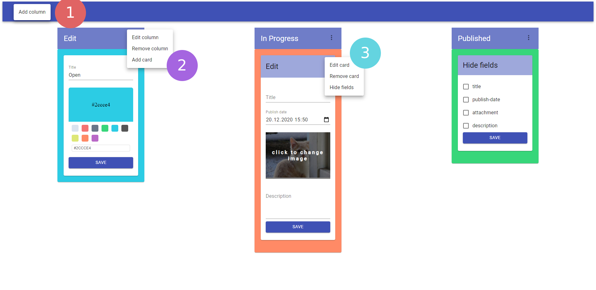

# KanbanState

-  (1) Adds a new column to the board
-  (2) Edit the current column and add cards
-  (3) Edit or remove the selected and newly added cards. Hide unused fields

## How to get the app running?
### Init
- yarn
### React
- yarn start
### Storybook
- yarn storybook